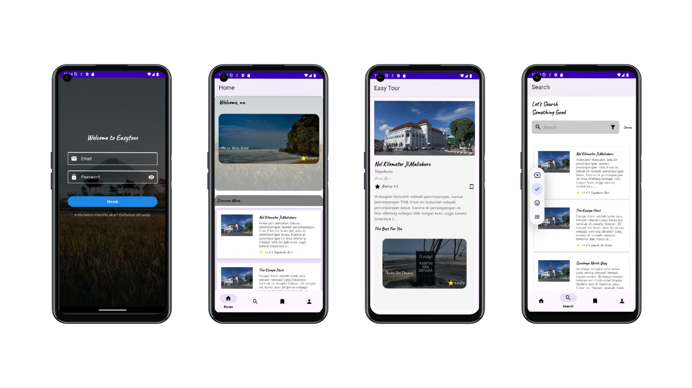

# EasyTour 🌍  
**EasyTour** is a modern tourism application designed to make exploring new destinations easier and more exciting based on your interest. Built with Kotlin and Android Studio, the app leverages powerful technologies such as Retrofit for API, and Room Database for offline storage.

---

## Features ✨  

### 1. **Explore Destinations**  
- Discover a wide range of tourist attractions in Indonesia, categorized by city, type, or popularity.  
- Search destinations by keyword to find exactly what you’re looking for.  

### 2. **Detailed Destination Information**  
- Access comprehensive details about each destination, including:  
  - Descriptions  
  - Photos  
  - Ratings  
  - Pricing information    

### 3. **Favorites**  
- Bookmark your favorite places to create a personalized travel list.  
- View and manage saved destinations in the Favorites section.  

### 4. **Filters**  
- Refine your search results by applying filters for:  
  - Location (city).  
  - Price range.  
  - Ratings (e.g., top-rated). 

### 5. **Offline Support**  
- Save important data like previously viewed destinations and favorites locally for offline access.  

### 6. **User Profile Management**  
- Sync user preferences and favorites across devices using cloud storage.   

---

## Technologies Used 🛠️  

### Software   
- **Kotlin**: The main programming language for Android development.  
- **Android Studio**: IDE for building and testing the application.  

### Frontend   
- **Material Design**: A modern, user-friendly interface design standard for consistent and intuitive user experience.  
- **RecyclerView**: Used for displaying and managing destination lists with smooth scrolling.  

### Backend   
- **Retrofit**: For API communication, handling HTTP requests, and fetching real-time destination data.  
- **Room Database**: A local database for storing user data, favorites, and search history for offline support. 
---

## Preview Mobile app
<<<<<<< HEAD
=======

>>>>>>> b511c6fa10a3364353b7aece31c8af1c068b15e7
<div align="center">
  
   
</div>

## Installation 🚀  
1. Clone the repository:  
   ```bash
   git clone --branch Mobile-Developmet https://github.com/RaffiDM/capstone-easytour.git
